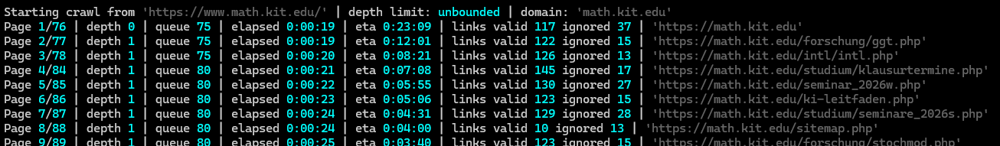
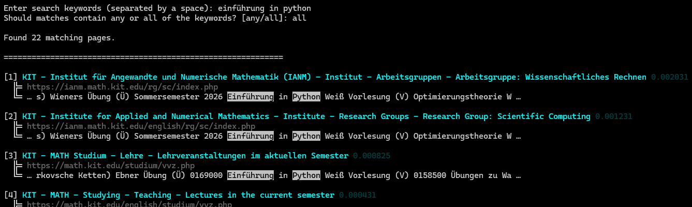
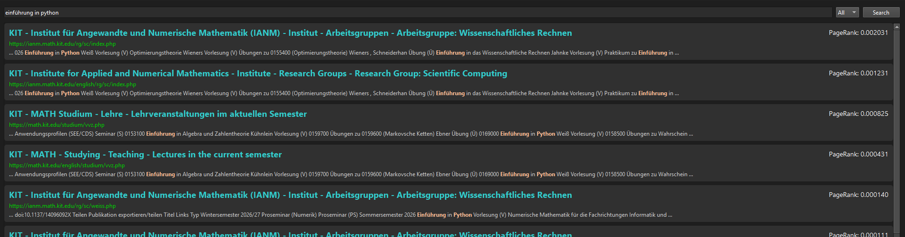

# Einfache Suchmaschine

Dieses Projekt implementiert eine Suchmaschine für die Homepage der Mathematik-Fakultät, sollte aber auch für beliebige andere Seiten funktionieren. Es besteht aus einem Webcrawler, einer Vorverarbeitung mit PageRank und einer textuellen beziehungsweise grafischen Benutzerschnittstelle. ([Arbeitsauftrag](spec.pdf))







## Übersicht

- `crawler.py`: Webcrawler, crawlt alle erwünschten Links ausgehend von beliebiger Startseite, speichert HTML(-Like)-Content als lokale Datei und Webgraph als SQLite.
- `preprocessing.py`: Parst Titel und Text aus gespeichertem Content, erstellt daraus SQLite FTS5-Table, berechnet PageRank.
- `search.py`: Implementiert die Suche über textuelle Benutzerschnittstelle, Sortierung der Antworten nach PageRank.
- `search_gui.py`: Implementiert die Suche über graphische Benutzerschnittstelle (PySide6).
- `main.py`: Führt alles aus, Suche wahlweise per CLI oder GUI.

## Requirements

```text
pip install -r requirements.txt
```

Getestet mit `Python 3.10.7`, `Pip 26.1.2`.

## Benutzung

Entweder `main.py` oder alles einzeln (`crawler.py`; `preprocessing.py`; `search.py` / `search_gui.py`) ausführen.

Gecrawlt wird standardmäßig ab `https://www.math.kit.edu/` innerhalb der Domain `math.kit.edu`.

Für einen Testlauf kann die maximale Crawling-Tiefe in `crawler.py` in `main()` über `limit` gesetzt werden. Für den vollständigen Lauf ist sie standardmäßig unbegrenzt.

## Erzeugte Dateien

- `metadata.db`: SQLite-Datenbank mit URLs und Links, später auch Seitentexte/-titel und PageRank-Werte.
- `site_storage/*`: Temporärer Speicher für heruntergeladene HTML-Dateien, wird nach `preprocessing.py` entfernt.
- `crawl.log`, `preprocessing.log`, `search_cli.log` und `search_gui.log`: Protokoll- und Fehlermeldungen der einzelnen Komponenten.